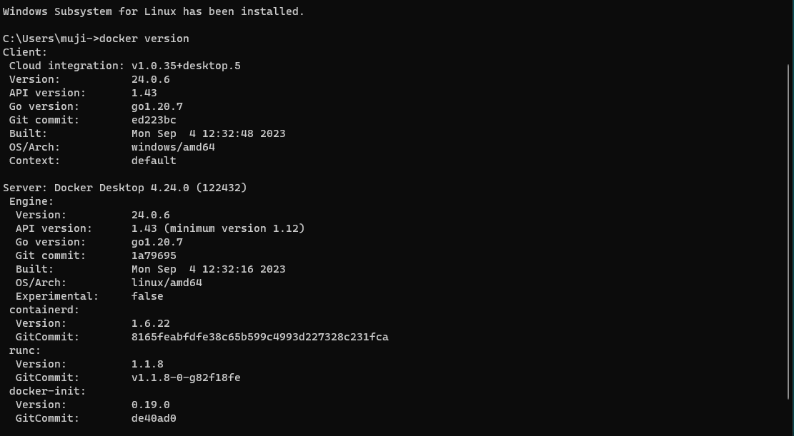
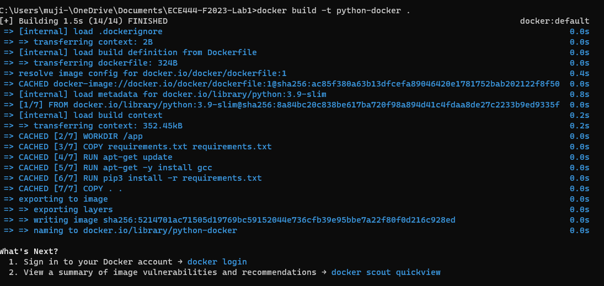
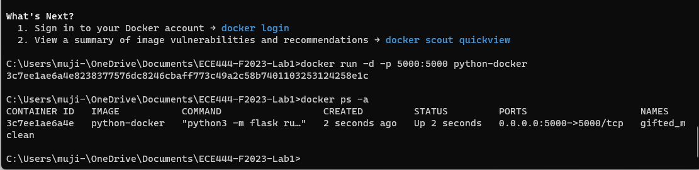
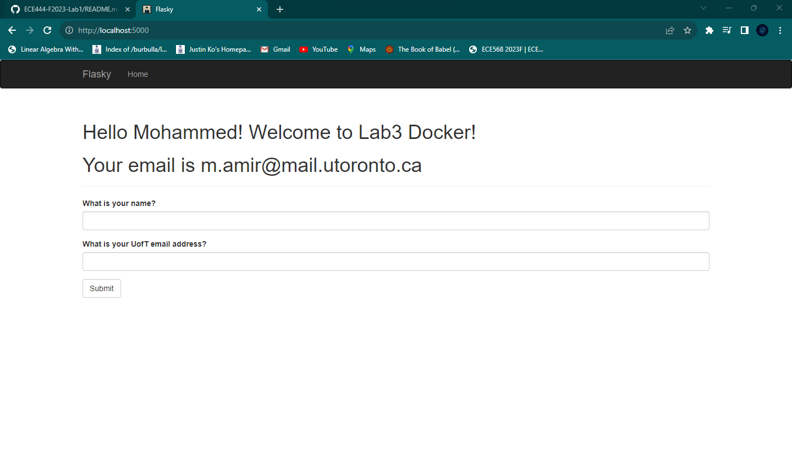

# Mohammed Amir

## Disclaimer

This repo is a clone of source code provided by Miguel Grinberg at https://github.com/miguelgrinberg/flasky as a way of
practicing Python Flask web development. 

## Branch Info

This branch of the project is meant to practice Docker Builds and Runs

### Activity 2

### Activity 3

### Activity 4

